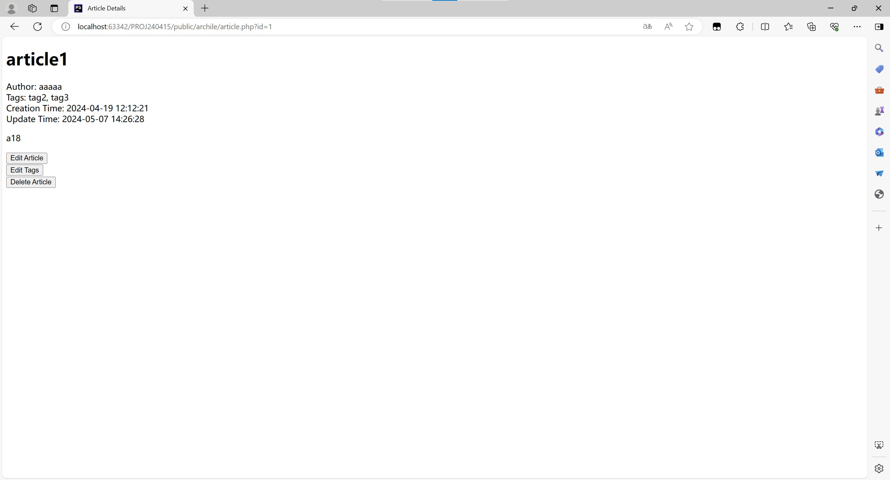
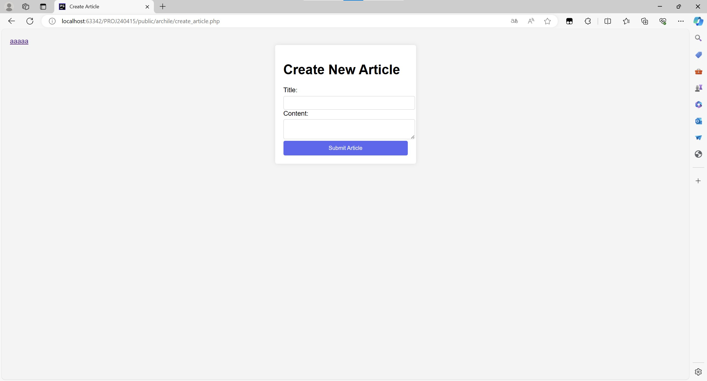
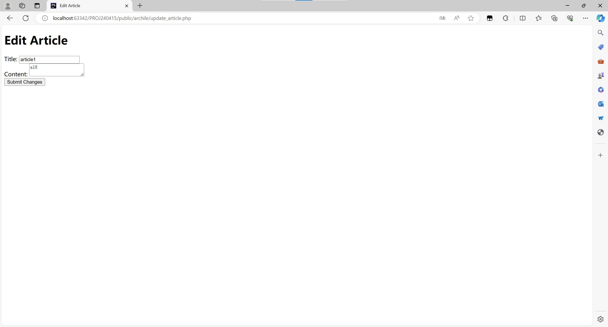
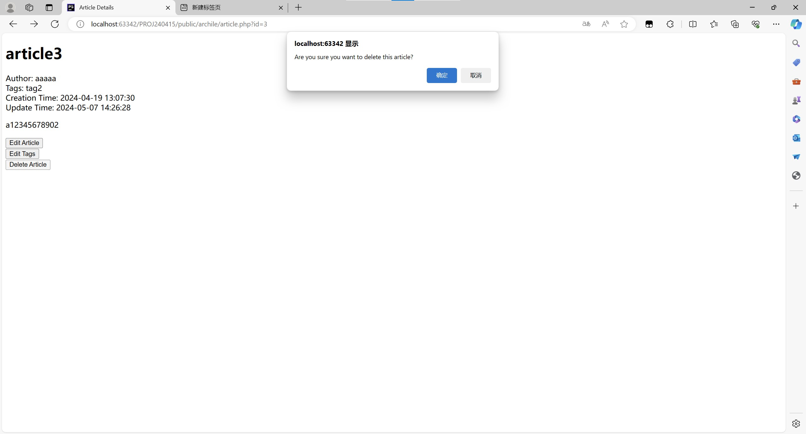
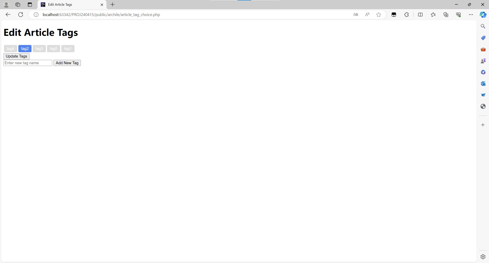
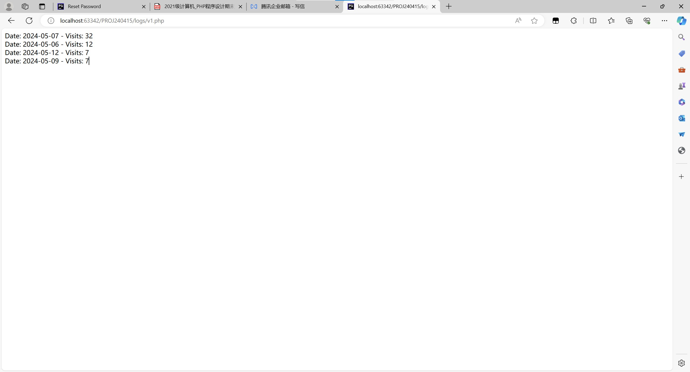
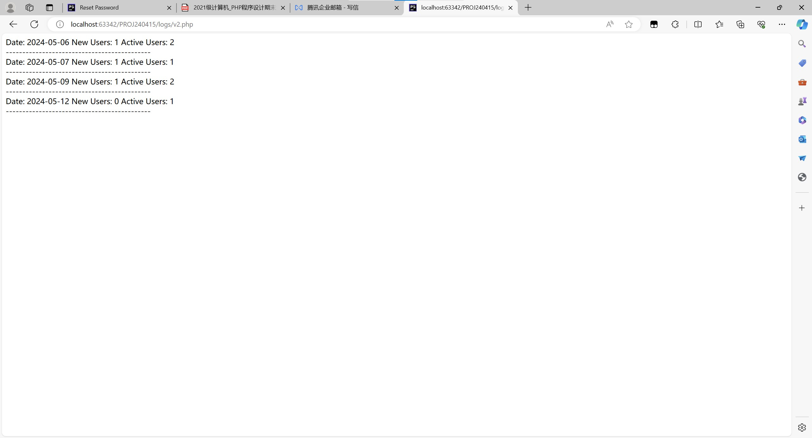
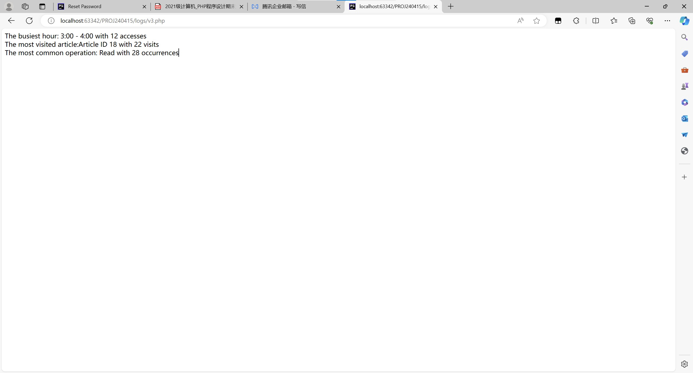
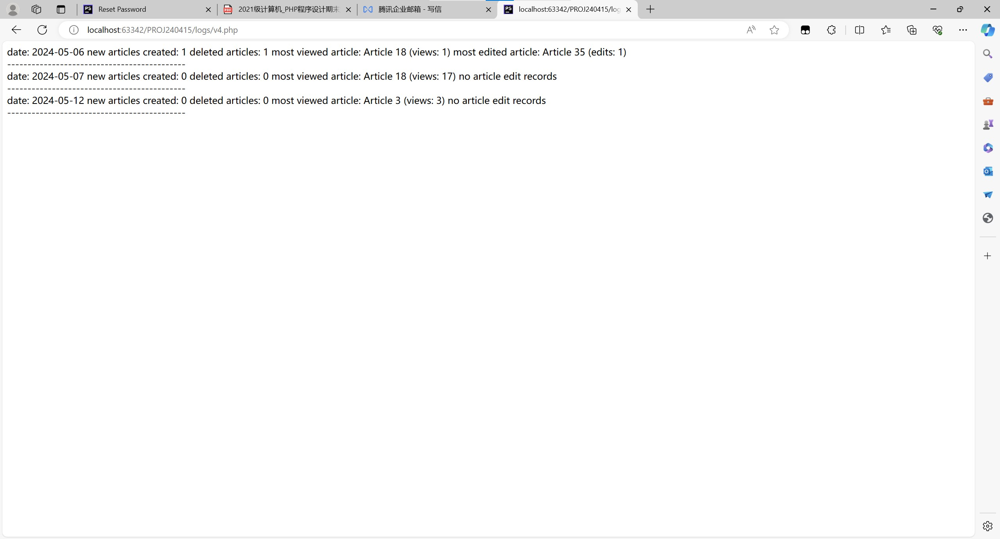
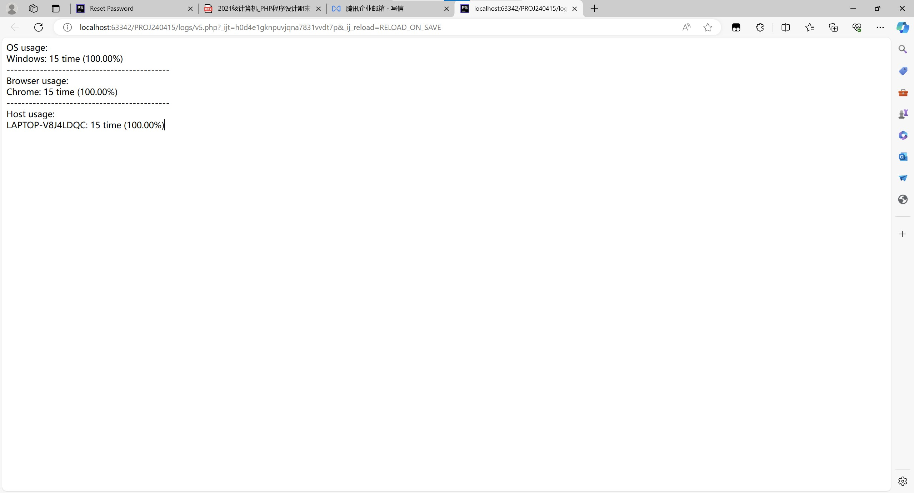

**Planète de Connaissance**

Ce projet est un système de gestion et une plateforme de forum basés sur PHP.

Il s'agit du projet de fin de semestre du cours de programmation PHP de l'université normale de Shanghai, niveau 2021.

# Table des Matières

- Introduction au Projet
  - Introduction aux Fonctionnalités de Base du Site
    - Modules Fonctionnels Principaux
      - Module Utilisateur
      - Module Article
        - Parcourir les Articles
        - Créer un Article
        - Modifier un Article
  - Conception de la Base de Données
    - Entités de la Base de Données
    - Relations de la Base de Données
    - API de la Couche Base de Données
  - Captures d'écran des Fonctionnalités du Site
  - Gestion des Utilisateurs
    - Inscription
    - Connexion
    - Informations Personnelles
      - Voir les Informations Personnelles
      - Modifier les Informations Personnelles
      - Modifier le Mot de Passe
      - Se Déconnecter
  - Gestion du Forum
    - Créer un Article
    - Éditer un Article
    - Supprimer un Article
    - Éditer le TAG d'un Article
- Implémentation des Fonctionnalités
  - Navigation de Base
    - Page d'Accueil
    - Page de Recherche
    - Détails de l'Article
  - Gestion des Utilisateurs
    - Inscription
    - Connexion
    - Informations Personnelles
    - Modifier le Mot de Passe
    - Se Déconnecter
  - Gestion du Forum
    - Créer un Article
    - Éditer un Article
    - Supprimer un Article
    - Éditer le TAG d'un Article
  - Gestion des Sessions
    - $_SESSION
    - $_COOKIE
  - Fonction de Pagination
  - Fonctionnalité des Journaux
    - Enregistrement des Journaux
    - Analyse des Journaux
  - Conception de la Sécurité
    - Chiffrement des Mots de Passe
    - Code Captcha de Connexion
    - Prévention des Injections SQL


# Introduction au Projet

Ce projet est un système de gestion de forum de type connaissance basé sur PHP, où les utilisateurs peuvent publier des articles, parcourir des articles, participer à l'édition des articles (y compris ceux des autres!), et utiliser un système de TAG pour trouver facilement les articles qui les intéressent.

## Introduction aux Fonctionnalités de Base du Site

## Modules Fonctionnels Principaux

### Module Utilisateur

Ce module comprend plusieurs fonctionnalités de gestion des utilisateurs :

- Inscription
- Connexion
- Informations personnelles
  - Voir les informations personnelles
  - Modifier les informations personnelles
- Modifier le mot de passe (réinitialisation du mot de passe)
- Se déconnecter

### Module Article

Ce module comprend plusieurs fonctionnalités de gestion des articles, classées par fonctionnalité :

#### Parcourir les Articles

La fonctionnalité de navigation est principalement divisée en une liste d'articles triés par date de mise à jour, une liste d'articles classée par TAG, et une fonctionnalité de recherche.

1. Pour la liste d'articles triés par date de mise à jour

   Les utilisateurs peuvent choisir la logique de pagination appropriée, voir le titre de l'article, l'auteur, la date de création et de mise à jour, le TAG, etc.
2. Pour la liste d'articles obtenue par la fonction de recherche

   En plus des fonctionnalités ci-dessus, les utilisateurs peuvent entrer des mots-clés pour rechercher des articles contenant ces mots-clés.
3. Pour la liste d'articles classée par TAG

   En plus de la fonctionnalité 1, les utilisateurs peuvent choisir le TAG approprié pour voir les articles contenant ce TAG.

   Les options de TAG ici sont générées automatiquement par le système, présentées en ordre décroissant de popularité (nombre d'articles contenant ce TAG).

   Les utilisateurs peuvent choisir plusieurs TAGs et peuvent basculer en un clic entre les logiques de filtrage des TAGs :

   - Inclusion totale
     Filtrer pour inclure les articles contenant tous les TAGs sélectionnés
   - Inclusion partielle
     Filtrer pour inclure les articles contenant n'importe quel TAG sélectionné

#### Créer un Article

Tous les utilisateurs connectés peuvent créer des articles. Lors de la création d'un article, l'utilisateur doit remplir le titre et le contenu, et devient automatiquement le premier auteur de l'article après la création réussie.

#### Modifier un Article

Tous les utilisateurs administrateurs peuvent modifier les articles. La modification principale inclut :

- Modification du contenu de l'article
  Possibilité de modifier le titre et le contenu. Après une modification réussie, l'utilisateur devient l'un des auteurs de l'article.
- Modification du TAG de l'article
  Possibilité de modifier le TAG de l'article, y compris l'ajout ou la suppression de TAGs, ou de créer un nouveau TAG pour cet article. La modification du TAG n'affecte pas les auteurs de l'article.
- Suppression d'un article
  Possibilité de supprimer un article, qui ne sera alors plus affiché dans la liste des articles.

## Conception de la Base de Données

### Entités de la Base de Données

1. Utilisateurs (Users) :

  - **user_id : clé primaire, entier auto-incrémenté, identifiant unique d'un utilisateur.**
  - username : nom d'utilisateur, unique et ne contient pas de virgule, utilisé pour la connexion.
  - password : mot de passe de l'utilisateur, stocké sous forme cryptée, pour sécuriser le compte.
  - email : adresse e-mail de l'utilisateur, utilisée pour le contact et la récupération du compte.
  - is_admin : valeur booléenne, indique si l'utilisateur est un administrateur, utilisée pour contrôler l'accès.

2. Articles (Articles) :

  - **article_id : clé primaire, entier auto-incrémenté, identifiant unique d'un article.**
  - title : titre de l'article.
  - content : contenu de l'article, stocké sous forme de texte long.
  - created_at : horodatage, heure de création de l'article, créée automatiquement.
  - updated_at : horodatage, heure de la dernière mise à jour de l'article, mise à jour automatiquement.

3. Tags (Tags) :

  - **tag_id : clé primaire, entier auto-incrémenté, identifiant unique d'un tag.**
  - tag_name : nom du tag, unique et ne contient pas de virgule.

4. Relations Tags-Articles (Article_Tags) :

  - **article_id et tag_id : clé primaire composée, identifiant la relation entre un article et un tag.**
    Les relations de clé étrangère pointent vers les tables Articles et Tags, avec suppression en cascade.

5. Relations Auteurs-Articles (Article_Authors) :

  - **article_id et user_id : clé primaire composée, identifiant la relation entre un article et un auteur.**
    Les relations de clé étrangère pointent vers les tables Articles et Users, avec suppression en cascade.

### Relations de la Base de Données

Relations multiples à multiples :

- Articles et Tags : via la table Article_Tags, mise en œuvre d'une relation multiples à multiples, un article peut avoir plusieurs tags, un tag peut marquer plusieurs articles.
- Articles et Utilisateurs : via la table Article_Authors, mise en œuvre d'une relation multiples à multiples, un article peut avoir plusieurs co-auteurs.

### API de la Couche Base de Données

Vues :

- article_tags_view : vue agrégée, affiche chaque article et tous ses tags.
- article_authors_view : vue agrégée, affiche chaque article et tous ses auteurs.
- article_detail_view : vue intégrée, affiche les détails de l'article, y compris le titre, les auteurs, les dates de création et de mise à jour, les tags et le contenu.
- article_list_view : vue de la liste des articles, affiche les informations de base des articles, prend en charge le tri et la pagination.
- article_count_view : vue de comptage des articles, affiche le nombre total d'articles.
- tag_article_count_view : vue de comptage des articles par tag, affiche le nombre d'articles sous chaque tag.

Procédures stockées :

- FetchArticlesByPage : obtention paginée de la liste des articles, prend en charge le tri par date de mise à jour.
- FetchArticlesByTagsWithPaging : filtre les articles selon les tags (permet plusieurs), et prend en charge la fonction de pagination. Permet une correspondance partielle des tags.
- FetchArticlesByAllTagsWithPaging : filtre les articles selon les tags (permet plusieurs), et prend en charge la fonction de pagination. Exige une correspondance complète avec les tags donnés.
- CreateArticle : crée un nouvel article et l'associe à son auteur.
- UpdateArticle : met à jour le contenu et le titre d'un article spécifié, et gère les informations des auteurs de l'article. Retourne activement des messages d'erreur en cas d'erreur.
- DeleteArticle : supprime un article selon son ID. Retourne activement des messages d'erreur en cas d'erreur.
- UpdateArticleTags : met à jour les tags d'un article spécifié, incluant l'ajout et la suppression de tags (permet plusieurs).
- SearchArticlesWithPaging : recherche des articles selon un mot-clé, et prend en charge la fonction de pagination.

## Captures d'écran des Fonctionnalités du Site

### Page d'Accueil


### Navigation par TAG


### Page de Recherche


### Détails de l'Article



## Gestion des Utilisateurs

### Inscription


### Connexion


### Informations Personnelles

#### Voir les Informations Personnelles


#### Modifier les Informations Personnelles


### Modifier le Mot de Passe


### Se Déconnecter


## Gestion du Forum

### Créer un Article



### Éditer un Article



### Supprimer un Article



### Éditer le TAG d'un Article



## Tableau de Correspondance Fonction-Fichier

- Répertoire Racine

    | Fonction                     | Nom de fichier        |
    |:-----------------------------|:----------------------|
    | Page principale du site, pour la fonction de navigation des articles | index.php             |
    | Fonction de recherche par mot-clé           | search_results.php    |

- db

    | Fonction | Nom de fichier |
    |:---------|:---------------|
    | Initialisation de la base de données | make.sql       |

- logs

    | Fonction             | Nom de fichier       |
    |:---------------------|:---------------------|
    | Journal des opérations liées aux articles | article_logs.txt |
    | Journal des opérations liées aux utilisateurs  | user.txt         |
    | Analyse du trafic quotidien      | v1.php           |
    | Nouveaux utilisateurs actifs/quotidiens | v2.php           |
    | Analyse des périodes/pages/opérations les plus fréquentées | v3.php           |
    | Statistiques quotidiennes des articles     | v4.php           |
    | Analyse des habitudes des utilisateurs     | v5.php           |
    | Page de navigation de l'analyse des journaux   | view.php         |

- css

    | Fonction | Nom de fichier |
    |:---------|:---------------|
    | Feuilles de style du site | style.css      |
    | Feuilles de style du site | style1.css     |

- public

    - archile

        | Fonction                  | Nom de fichier            |
        |:--------------------------|:--------------------------|
        | Affichage des détails d'un article unique          | article.php               |
        | Mise à jour des TAGs d'un article (ajout de nouveaux TAGs) | article_tag_choice.php   |
        | Création d'un article              | create_article.php     |
        | Mise à jour d'un article              | update_article.php     |

    - user

        | Fonction | Nom de fichier         |
        |:---------|:-----------------------|
        | Mise à jour des informations utilisateur | edit_profile.php       |
        | Connexion utilisateur     | login.php                |
        | Affichage des informations utilisateur   | profile.php            |
        | Inscription utilisateur     | register.php             |
        | Réinitialisation (réinitialisation) du mot de passe | reset_password.php |


- src

   | Fonction       | Nom de fichier       | 
   |:---------------|:---------------------|
   | Génération du captcha        | captcha.php          |
   | Configuration de base pour la connexion à la base de données | config.php           |
   | API de vérification de connexion utilisateur   | login.php            |
   | API de déconnexion utilisateur     | logout.php           |
   | API de vérification d'inscription utilisateur   | register.php         |
   | API de réinitialisation du mot de passe utilisateur   | reset_password.php   |
   | API de mise à jour des informations personnelles de l'utilisateur | update_profile.php   |

    - api

        | Fonction                              | Nom de fichier           |
        |:--------------------------------------|:-------------------------|
        | API pour ajouter un nouveau TAG                   | add_tag.php              |
        | API pour retourner les détails d'un article                    | article.php              |
        | API pour retourner le nombre total d'articles                    | article_count_view.php   |
        | API pour ajouter ou retirer des TAGs à un article              | article_tag.php          |
        | API pour retourner la liste des articles paginés selon les TAGs choisis (incluant n'importe quel TAG) | articles.php             |
        | API pour retourner la liste des articles paginés selon les TAGs choisis (incluant tous les TAGs)  | articles_all_tags.php    |
        | API pour créer un nouvel article                      | creat_article.php        |
        | API pour supprimer un article                      | delete_article.php       |
        | API pour retourner tous les TAGs inclus dans un article              | get_article.php          |
        | API pour retourner la liste paginée de tous les articles dont les titres contiennent des mots-clés      | search_articles.php      |
        | API pour retourner tous les TAGs (triés par popularité décroissante)           | tags.php                 |
        | API pour mettre à jour un article                      | update_article.php       |

# Implémentation des Fonctionnalités

## Navigation de Base

### Page d'Accueil

La page d'accueil est la page principale du site, utilisée pour afficher la fonction de navigation des articles, incluant :

- Liste des articles triés par date de mise à jour (par défaut)
- Liste des articles classée par TAG
- Navigation vers la page de recherche
- Navigation vers la page de connexion (si non connecté)
- Navigation vers la page d'informations personnelles (si connecté)

#### Affichage de la Liste des Articles
La liste des articles affichée sur la page d'accueil est triée selon la date de mise à jour des articles, montrant par défaut les articles les plus récemment mis à jour. Le format d'affichage de chaque article comprend le titre de l'article, la date de mise à jour, la date de création, l'auteur et les tags associés. Les utilisateurs peuvent cliquer sur le titre de l'article pour accéder à la page détaillée de l'article.

#### Affichage de la Classification des Articles par Tags
La page d'accueil contient également une liste dynamique de tags d'articles. Ces tags sont obtenus via l'API du backend `src/api/tags.php` et sont affichés sous forme de boutons sur la page. Les utilisateurs peuvent cliquer sur ces boutons de tags pour filtrer la liste des articles, affichant les articles associés aux tags sélectionnés.

##### Logique de Changement de Tags
Il y a un bouton de basculement `Switch to All-Inclusive` qui permet aux utilisateurs de basculer entre les articles contenant tous les tags sélectionnés ("mode inclusif total") et les articles contenant n'importe quel tag sélectionné ("mode inclusif partiel"). Cette fonctionnalité est implémentée via la logique frontale, en changeant l'état et le nom de classe du bouton pour représenter le mode actuel.

##### Explications des Appels API
- **Chargement des Tags** : Lorsque la page se charge, la fonction `loadTags` appelle l'API `src/api/tags.php` pour obtenir tous les tags disponibles. Cette API retourne une liste de tags, chaque tag étant utilisé pour générer un bouton sur la page.
- **Filtrage des Articles** : Lorsque l'utilisateur clique sur les boutons de tags pour filtrer les articles, selon le mode de sélection de tags actuel (inclusif total ou inclusif partiel), la page appelle différentes API :
  - **Mode inclusif total** : Appelle `src/api/articles_all_tags.php`, en passant les ID de tags sélectionnés, et retourne les articles contenant tous ces tags.
  - **Mode inclusif partiel** : Appelle `src/api/articles.php`, en passant les ID de tags sélectionnés, et retourne les articles contenant n'importe quel de ces tags.

#### Fonction de Pagination
La liste des articles prend en charge la navigation paginée, avec des boutons de contrôle de pagination en bas incluant "Page précédente" et "Page suivante". Les utilisateurs peuvent également entrer un numéro de page pour sauter directement à une page spécifique ou choisir le nombre d'articles affichés par page (5, 10, 15, 20). Ces fonctionnalités sont implémentées via des appels d'interface de pagination pour charger dynamiquement les données des articles de la page spécifiée.

#### Navigation vers la Page de Recherche
Un bouton fournit un lien vers `search_results.php`, permettant aux utilisateurs de passer à la page de recherche pour effectuer une recherche d'articles.

#### Affichage du Statut de Connexion de l'Utilisateur
- **Si non connecté** : Si l'utilisateur n'est pas connecté, un lien de connexion s'affiche en haut de la page d'accueil, pointant vers `user/login.php`, permettant à l'utilisateur de se connecter.
- **Si connecté** : Si l'utilisateur est connecté, le nom d'utilisateur s'affiche en haut de la page d'accueil, fournissant un lien vers `user/profile.php`, permettant à l'utilisateur d'accéder et de modifier ses informations personnelles.

### Détails Techniques de l'Implémentation

- **Gestion des Sessions Backend** : Utilise la fonction PHP `session_start()` pour gérer les sessions utilisateur.
- **Chargement Dynamique du Contenu Frontal** : Utilise la bibliothèque Axios pour interagir avec les API backend via des requêtes AJAX, chargeant dynamiquement la liste des articles et des tags.
- **Navigation de la Page Frontale** : Utilise JavaScript pour contrôler la logique de navigation de la page, comme la pagination des articles et

 la navigation entre les pages.
- **Sécurité** : Utilise la fonction PHP `htmlspecialchars` pour traiter les sorties, prévenant les attaques XSS.

### Page de Recherche

La page de recherche d'articles permet aux utilisateurs d'entrer des mots-clés pour rechercher des titres d'articles et affiche les résultats de la recherche. Voici une explication détaillée des fonctionnalités et des détails techniques de l'implémentation :

#### Entrée de Recherche et Bouton
- **Boîte de recherche** : La page fournit une boîte d'entrée où les utilisateurs peuvent entrer les mots-clés du titre de l'article qu'ils souhaitent rechercher.
- **Bouton de recherche** : Un bouton de recherche est situé à côté de la boîte d'entrée. Lorsque l'utilisateur clique sur ce bouton, la recherche est effectuée en fonction des mots-clés entrés. Les résultats de la recherche sont affichés dynamiquement dans la liste ci-dessous.

#### Explications des Appels API
- **Recherche d'Articles** : Lorsque l'utilisateur clique sur le bouton de recherche, la page appelle l'API `src/api/search_articles.php`, passant les mots-clés de la requête, le numéro de page actuel, et le nombre d'articles à afficher par page comme paramètres. Cette API retourne une liste d'articles correspondant aux critères de la requête.
- **Traitement de la Réponse** : Le frontal envoie une requête GET via Axios, et les données reçues sont utilisées pour générer dynamiquement l'affichage détaillé de chaque article, incluant le titre, la date de mise à jour, la date de création, l'auteur et les tags.

### Fonction de Pagination
Les résultats de la recherche prennent en charge l'affichage paginé, avec les fonctionnalités suivantes :

- **Contrôles de Pagination** : Des boutons de contrôle de pagination sont situés en bas de la page, incluant "Page précédente", "Page suivante", et une boîte d'entrée "Aller à la page", ainsi qu'une liste déroulante pour choisir le nombre d'articles à afficher par page (5, 10, 15, 20 articles).
- **Chargement Dynamique** : Les utilisateurs peuvent naviguer entre différentes pages de résultats de recherche en cliquant sur les boutons "Page précédente" et "Page suivante". Ils peuvent également entrer un numéro de page et cliquer sur le bouton "Aller" pour sauter rapidement à la page spécifiée.

### Affichage du Statut de Connexion de l'Utilisateur
- **Si non connecté** : Si l'utilisateur n'est pas connecté, un lien "Connexion" s'affiche en haut de la page, qui, lorsqu'on clique dessus, redirige vers la page de connexion.
- **Si connecté** : Si l'utilisateur est connecté, le nom d'utilisateur s'affiche en haut de la page, cliquer sur le nom d'utilisateur redirige vers la page de profil de l'utilisateur.

### Détails Techniques de l'Implémentation
- **Chargement Dynamique du Contenu Frontal** : Utilise la bibliothèque Axios pour interagir avec les API backend via des requêtes AJAX, chargeant dynamiquement les résultats de la recherche.
- **Gestion des Sessions** : Utilise la fonction PHP `session_start()` pour gérer les sessions utilisateur, vérifiant si l'utilisateur est connecté et affichant en conséquence les informations utilisateur ou le lien de connexion.
- **Sécurité** : Utilise la fonction PHP `htmlspecialchars` pour traiter les entrées et les sorties des utilisateurs, prévenant les attaques XSS.
- **Interactions Utilisateur** : Utilise JavaScript pour écouter les événements des éléments de la page (comme les boutons et les zones de texte) et implémenter la logique de réponse aux interactions utilisateur.

### Détails de l'Article

Chaque article listé peut être sélectionné pour accéder à la page de détails de l'article.
La page de détails de l'article fournit aux utilisateurs la possibilité de voir le texte complet de l'article et des informations connexes, et offre aux administrateurs des options pour éditer et supprimer l'article. Voici une explication détaillée des fonctionnalités et des détails techniques de l'implémentation :

#### Agencement de la Page
- **Titre et Métadonnées** : La page aff

iche le titre de l'article, les auteurs, les tags, la date de création et la date de mise à jour.
- **Contenu de l'Article** : Le contenu principal de l'article est affiché dans la partie centrale de la page, prenant en charge les formats HTML de base, tels que les sauts de ligne.

#### Appels API
- **Obtention des Détails de l'Article** : Lors du chargement de la page, un appel est fait à l'API `../../src/api/article.php` pour obtenir les détails de l'article. Cette API nécessite l'ID de l'article comme paramètre, les données retournées sont utilisées pour remplir les différentes sections de la page.

### Fonctionnalités de Gestion (Réservées aux Administrateurs)

#### Édition de l'Article
- **Formulaire d'Édition de l'Article** : Si l'utilisateur est un administrateur, la page affichera un bouton "Éditer l'article". Cliquer sur ce bouton redirigera vers `update_article.php` via un formulaire soumis, incluant un champ caché contenant l'ID de l'article.
- **Formulaire d'Édition des Tags** : De même, il y aura un bouton "Éditer les Tags", qui redirigera vers `article_tag_choice.php`, utilisé pour éditer les tags de l'article.

#### Suppression de l'Article
- **Bouton de Suppression** : Les administrateurs peuvent également voir un bouton "Supprimer l'article". Cliquer sur ce bouton déclenchera l'opération de suppression, qui, après confirmation de l'utilisateur, appellera l'API `../../src/api/delete_article.php` pour supprimer l'article.
- **Confirmation de Suppression** : En cliquant sur le bouton de suppression, une boîte de dialogue de confirmation apparaîtra, et l'opération de suppression ne sera exécutée qu'après confirmation, afin d'éviter toute action accidentelle.

### Détails Techniques de l'Implémentation

- **Contrôle des Permissions** : La page vérifie côté serveur l'état de connexion de l'utilisateur et son statut d'administrateur. Si l'utilisateur n'est pas connecté, il est redirigé vers la page de connexion. Si l'utilisateur n'est pas un administrateur, les fonctionnalités de gestion ne sont pas affichées.
- **Chargement Dynamique du Contenu Frontal** : Utilise la bibliothèque Axios pour interagir avec les API backend via des requêtes AJAX, chargeant dynamiquement les détails de l'article.
- **Interactions Utilisateur** : Utilise JavaScript pour écouter les événements et gérer les opérations utilisateur, telles que cliquer sur des boutons pour effectuer des recherches, des éditions et des suppressions.
- **Sécurité** : Utilise la fonction PHP `htmlspecialchars` pour traiter le contenu généré par l'utilisateur affiché, afin de prévenir les attaques XSS.

## Gestion des Utilisateurs

### Inscription

La page d'inscription contient un formulaire permettant à l'utilisateur de saisir un nom d'utilisateur, un mot de passe et une adresse e-mail.
Lorsque l'utilisateur soumet le formulaire, celui-ci est posté à `src/register.php` via POST, et cette API vérifie si la soumission est valide.

Une soumission valide doit respecter les critères suivants :

- Le nom d'utilisateur doit comporter au moins 5 caractères et ne doit pas déjà exister.
- Le mot de passe doit comporter au moins 8 caractères et contenir à la fois des chiffres et des lettres.
- L'adresse e-mail doit être valide.

Si la soumission n'est pas valide, l'utilisateur est redirigé vers la page d'inscription via GET, où la page vérifie s'il y a un champ d'erreur et génère des messages d'erreur pertinents en fonction des mots-clés.
Sinon, une page de bienvenue est affichée, et après quelques secondes, l'utilisateur est redirigé vers la page de connexion.

### Connexion

La page de connexion contient un formulaire demandant à l'utilisateur de saisir un nom d'utilisateur, un mot de passe et un code captcha, ainsi qu'un bouton d'inscription et un lien indiquant "J'ai oublié mon mot de passe".

Cliquer sur le bouton d'inscription redirige vers la page d'inscription.
Cliquer sur le lien "J'ai oublié mon mot de passe" redirige vers la page de réinitialisation du

 mot de passe.
Cliquer sur l'image du captcha rafraîchit le captcha.

Le captcha est généré dans `src/captcha.php`, et la clé correcte est sauvegardée dans `$_SESSION`.

Lorsque l'utilisateur soumet le formulaire de connexion, celui-ci est posté à `src/login.php` via POST, et cette API vérifie si la soumission est valide.

Une soumission valide doit respecter les critères suivants :
- Le captcha est correct.
- Le nom d'utilisateur et le mot de passe correspondent.

Si la soumission n'est pas valide, l'utilisateur est redirigé vers la page de connexion via GET, où la page vérifie s'il y a un champ d'erreur et génère des messages d'erreur pertinents en fonction des mots-clés.

Sinon, l'utilisateur est redirigé vers la page d'accueil.

#### Administrateur

Les utilisateurs administrateurs n'ont pas de page de connexion ou de gestion spéciale, mais ils peuvent modifier les articles, supprimer des articles, et éditer les tags des articles.

Le signe qu'un utilisateur est un administrateur est que `$_SESSION['is_admin']` est `true`.

Si l'utilisateur est un administrateur, les boutons pour éditer les tags, éditer les articles et supprimer des articles sont affichés sur la page de détails de l'article, ainsi qu'un lien pour voir l'analyse des logs sur la page des informations personnelles.

Il n'est pas nécessaire de s'inquiéter que les utilisateurs ordinaires puissent obtenir des droits d'administrateur en modifiant le code frontal, car l'API vérifie si l'utilisateur est un administrateur.

### Informations Personnelles

#### Voir les Informations Personnelles

La page des informations personnelles affiche le nom d'utilisateur de l'utilisateur, son adresse e-mail, s'il est administrateur, et la date d'inscription. Elle génère également des liens vers la page de modification des informations personnelles, la page de déconnexion, et la page d'analyse des logs.

#### Modifier les Informations Personnelles

La page de modification des informations personnelles contient un formulaire demandant à l'utilisateur de saisir un nouveau nom d'utilisateur et une nouvelle adresse e-mail.

La page commence par interroger les informations originales de l'utilisateur pour les afficher comme valeurs par défaut dans le formulaire.

Lorsque l'utilisateur soumet le formulaire de modification, celui-ci est posté à `src/update_profile.php` via POST, et cette API vérifie si la soumission est valide.

Une soumission valide doit respecter les critères suivants :
- Le nom d'utilisateur doit comporter au moins 5 caractères et ne doit pas déjà exister.
- L'adresse e-mail doit être valide.

Si la soumission n'est pas valide, l'utilisateur est redirigé vers la page de modification des informations personnelles via GET, où la page vérifie s'il y a un champ d'erreur et génère des messages d'erreur pertinents en fonction des mots-clés.

Sinon, un message de succès est affiché, et après quelques secondes, l'utilisateur est redirigé vers la page des informations personnelles.

### Modifier le Mot de Passe

La page de modification du mot de passe contient un formulaire demandant à l'utilisateur de saisir son nom d'utilisateur et un nouveau mot de passe.

Lorsque l'utilisateur soumet le formulaire de modification du mot de passe, celui-ci est posté à `src/reset_password.php` via POST, et cette API vérifie si la soumission est valide.

Une soumission valide doit respecter les critères suivants :
- Le mot de passe doit comporter au moins 8 caractères et contenir à la fois des chiffres et des lettres.

Si la soumission n'est pas valide, l'utilisateur est redirigé vers la page de modification du mot de passe via GET, où la page vérifie s'il y a un champ d'erreur et génère des messages d'erreur pertinents en fonction des mots-clés.

Sinon, un message de succès est affiché, et après quelques secondes, l'utilisateur est redirigé vers la page de connexion.

### Se Déconnecter

Se déconnecter efface `$_SESSION` et `$_COOKIE` et redirige vers la page d'accueil.

```php
$_SESSION = array();
session_destroy();
```

```php
setcookie("username", "", time()-3600, "/");
```

## Gestion du Forum

### Créer un Article

Tous les utilisateurs connectés peuvent créer des articles, et lors de la création d'un article, ils doivent remplir le titre et le contenu, et deviennent automatiquement le premier a

uteur de l'article après la création réussie.

La vérification des permissions se fait en deux parties, une partie est la présentation de la page, et l'autre partie est la vérification de l'API.

Sur la page de présentation, il est vérifié si l'utilisateur est connecté, et s'il ne l'est pas, il est redirigé vers la page de connexion.

```php
<div class="user-info">
    <?php if (isset($_SESSION['username'])): ?>
        <a href="../user/profile.php"><?php echo htmlspecialchars($_SESSION['username']); ?></a>
    <?php else:
        header('Location: ../user/login.php');
    endif; ?>
</div>
```

Lors de la vérification de l'API, il est vérifié si l'utilisateur est connecté, et s'il ne l'est pas, un message d'erreur est renvoyé.

```php
$author_id = $_SESSION['user_id'] ?? null;
if (!$author_id) {
    echo json_encode(['success' => false, 'message' => 'login required']);
    exit;
}
```

La page de création d'article permet aux utilisateurs connectés de créer de nouveaux articles. Voici une explication détaillée des fonctionnalités et des détails techniques de l'implémentation :

#### Formulaire de Création d'Article
- **Entrée du Titre** : La page contient une zone de texte pour saisir le titre de l'article. Cette zone est obligatoire.
- **Entrée du Contenu** : Il y a aussi une zone de texte pour que l'utilisateur saisisse le contenu de l'article. Ceci est également obligatoire.
- **Bouton de Soumission** : Un bouton est disponible pour soumettre l'article. Lorsque cet bouton est cliqué, la page utilise la fonction JavaScript `submitArticle` pour lancer la requête de création de l'article.

#### Détails Techniques de l'Implémentation

##### Traitement du Formulaire Frontal
- **Validation des Entrées** : JavaScript est utilisé pour valider les entrées de titre et de contenu au niveau frontal. Si l'utilisateur tente de soumettre un titre ou un contenu vide, un message d'alerte s'affiche et la soumission du formulaire est bloquée.
- **Soumission du Formulaire** : La fonction JavaScript `submitArticle` gère la logique de soumission du formulaire. Cette fonction vérifie les entrées, construit une requête GET contenant le titre et le contenu, et l'envoie à l'API backend.

##### Appels API
- **Création d'Article** : Lorsque l'utilisateur clique sur le bouton "Soumettre l'article", JavaScript appelle l'API backend `../../src/api/create_article.php`. Cette API accepte le titre et le contenu comme paramètres et crée un nouvel enregistrement d'article.
- **Traitement des Réussites et des Erreurs** : Après l'appel de l'API, selon la réponse du serveur, un message de succès ou d'erreur est affiché à l'utilisateur. Si la création est réussie, l'utilisateur est redirigé vers la page de détails du nouvel article. Si la création échoue ou en cas d'erreur, un message d'erreur est affiché à l'utilisateur.

##### Sécurité et Maintenance
- **Nettoyage des Entrées** : La fonction PHP `htmlspecialchars` est utilisée pour traiter l'affichage du nom d'utilisateur, prévenant les attaques par script intersite (XSS).
- **Gestion des Erreurs** : La gestion des erreurs dans JavaScript assure que des retours clairs sont fournis à l'utilisateur en cas d'erreurs réseau ou serveur.


### Éditer un Article

Tous les utilisateurs administrateurs peuvent modifier des articles.

La vérification des permissions se fait en deux parties, une partie est la présentation de la page, et l'autre partie est la vérification de l'API.

Sur la page de présentation, il est vérifié si l'utilisateur est un administrateur, et s'il l'est, les boutons pour éditer les tags, éditer l'article et supprimer l'article sont affichés.
Sinon, ces boutons ne sont pas affichés.

Lors de la vérification de l'API, il est vérifié si l'utilisateur est un administrateur, et s'il ne l'est pas, un message d'erreur est renvoyé.

```php
if (!isset($_SESSION['user_id'])) {
    http_response_code(401);     echo json_encode(['message' => 'login required']);
    exit;
}

if (!isset($_SESSION['is_admin']) || $_SESSION['is_admin'] != 1) {
    http_response_code(403);     echo json_encode(['message' => 'Access Denied: You are not an admin']);
    exit;
}
```

#### Agencement de la Page et Fonctionnalités

##### Initialisation du Formulaire
- **Vérification de l'ID de l'Article** : Lors du chargement de la page, il est d'abord vérifié si un ID d'article est passé. Si aucun ID d'article n'est présent, un message d'erreur est affiché, et l'utilisateur est redirigé vers la page précédente.
- **Remplissage du Formulaire** : Si un ID d'article est présent, la page appelle l'API backend pour obtenir les détails actuels de l'article et remplit automatiquement le formulaire pour permettre à l'utilisateur de procéder à l'édition.

#### Détails Techniques de l'Implémentation

##### Obtention des Données
- **Obtention des Détails de l'Article** : La méthode `fetch` de JavaScript est utilisée pour appeler `../../src/api/article.php`, en passant l'ID de l'article pour demander les détails actuels de l'article. Après une réponse réussie de l'API, le titre et le contenu de l'article sont remplis dans le formulaire, prêts pour l'édition.
- **Gestion des Erreurs** : Si l'obtention des détails de l'article échoue, un message d'erreur est affiché sur la page, et l'utilisateur a la possibilité de retourner à la page précédente pour réessayer.

##### Soumission du Formulaire
- **Soumission des Mises à Jour** : Le formulaire est soumis via une méthode AJAX, évitant le rechargement de la page. Après que l'utilisateur ait édité le titre et le contenu, il clique sur le bouton "Soumettre les Changements" qui envoie une requête GET à `../../src/api/update_article.php` via `axios`. La requête inclut l'ID de l'article, le titre mis à jour et le contenu.
- **Retour sur la Mise à Jour** : Après la soumission, selon la réponse du serveur, un message de succès ou d'erreur est affiché à l'utilisateur. Si la mise à jour réussit, la page est redirigée vers la page de détails de l'article.

### Sécurité et Maintenance
- **Vérification des Permissions Utilisateur** : Le script côté serveur vérifie avant le chargement de la page si l'utilisateur a le droit de procéder à l'édition, assurant que seuls les utilisateurs autorisés peuvent éditer l'article.
- **Nettoyage des Entrées** : Les données soumises sont nettoyées et validées par le script backend, prévenant les attaques par injection et autres menaces sécuritaires.


### Supprimer un Article

Tous les utilisateurs administrateurs peuvent supprimer des articles.

La vérification des permissions se fait en deux parties, une partie est la présentation de la page, et l'autre partie est la vérification de l'API.

Sur la page de présentation, il est vérifié si l'utilisateur est un administrateur, et s'il l'est, les boutons pour éditer les tags, éditer l'article et supprimer l'article sont affichés.
Sinon, ces boutons ne sont pas affichés.

Lors de la vérification de l'API, il est vérifié si l'utilisateur est un administrateur, et s'il ne l'est pas, un message d'erreur est renvoyé.

```php
if (!isset($_SESSION['user_id'])) {
    http_response_code(401);     echo json_encode(['message' => 'login required']);
    exit;
}

if (!isset($_SESSION['is_admin']) || $_SESSION['is_admin'] != 1) {
    http_response_code(403);     echo json_encode(['message' => 'Access Denied: You are not an admin']);
    exit;
}
```

Cette fonctionnalité est directement intégrée dans la page de détails de l'article, permettant aux utilisateurs administrateurs de cliquer sur le bouton "Supprimer l'article" pour supprimer l'article.

```php
function deleteArticle() {
        const articleId = new URLSearchParams(window.location.search).get('id');
        if (confirm("Are you sure you want to delete this article?")) {
            axios.get(`../../src/api/delete_article.php?article_id=${articleId}`)
                .then(function (response) {
                    alert(response.data.message);
                    if (response.data.message.startsWith('Success')) {
                        // back
                        window.history.back();
                    }
                })
                .catch(function (error) {
                    console.error('Error deleting the article:', error);
                    alert('An error occurred while deleting the article');
                });
        }
    }
```

### Éditer les Tags d'un Article

Tous les utilisateurs administrateurs peuvent éditer les tags d'un article.

La vérification des permissions se fait en deux parties, une partie est la présentation de la page, et l'autre partie est la vérification de l'API.

Sur la page de présentation, il est vérifié si l'utilisateur est un administrateur, et s'il l'est, les boutons pour éditer les tags, éditer l'article et supprimer l'article sont affichés.
Sinon, ces boutons ne sont pas affichés.

Lors de la vérification de l'API, il est vérifié si l'utilisateur est un administrateur, et s'il ne l'est pas, un message d'erreur est renvoyé.

```php
if (!isset($_SESSION['user_id'])) {
    http_response_code(401);     echo json_encode(['message' => 'login required']);
    exit;
}

$userId = $_SESSION['user_id'];

if ($_SERVER['REQUEST_METHOD'] != 'POST') {
    http_response_code(405);     echo json_encode(['message' => 'Request method must be POST']);
    exit;
}

if (!isset($_SESSION['is_admin']) || $_SESSION['is_admin'] != 1) {
    http_response_code(403);     echo json_encode(['message' => 'Access Denied: You are not an admin']);
    exit;
}
```

```php
if (!isset($_SESSION['user_id'])) {
    http_response_code(401);     echo json_encode(['message' => 'login required']);
    exit;
}

if (!isset($_SESSION['is_admin']) || $_SESSION['is_admin'] != 1) {
    http_response_code(403);     echo json_encode(['message' => 'Access Denied: You are not an admin']);
    exit;
}
```

## Gestion des Sessions

### $_SESSION

Lorsqu'un utilisateur se connecte, son nom d'utilisateur est sauvegardé dans `$_SESSION`, permettant de savoir si l'utilisateur est connecté lorsqu'il visite d'autres pages, et de connaître d'autres informations telles que le nom d'utilisateur, s'il est administrateur, etc.

```php
if (password_verify($password, $hashed_password)) {
        $_SESSION = array();
        $_SESSION['loggedin'] = true;
        $_SESSION['username'] = $username;
        $_SESSION['user_id'] = $id;
        $_SESSION['email'] = $email;
        $_SESSION['is_admin'] = $is_admin;
        // other code
    }
```

Lorsqu'un utilisateur se déconnecte, `$_SESSION` est vidé.

```php
$_SESSION = array();
session_destroy();
```

### $_COOKIE

Lorsqu'un utilisateur se connecte, son nom d'utilisateur est sauvegardé dans `$_COOKIE`.
Lorsqu'il visite à nouveau le site dans le délai imparti, son nom d'utilisateur est automatiquement rempli.

```php
if (password_verify($password, $hashed_password)) {
        // other code
        setcookie('username', $username, time() + 3600, '/');
        // other code
    }
```

Lorsqu'un utilisateur se déconnecte volontairement, `$_COOKIE` est vidé.

```php
setcookie("username", "", time()-3600, "/");  
```

Lorsqu'un utilisateur filtre les tags, ses choix de tags sont sauvegardés dans `$_COOKIE`.

```php
if (isset($_POST['tag_ids'])) {
    $tag_ids = $_POST['tag_ids'];
    setcookie('tag_ids', $tag_ids, time() + 3600, '/');
}
```

## Fonction de Pagination

La logique de pagination est implémentée au niveau de la base de données, et PHP ne peut obtenir qu'une page de données et le nombre d'entrées correspondant aux critères.

Voici un exemple de la logique de pagination pour la liste des articles classée par tags (incluant n'importe quel tag).

```mysql
-- Create stored procedure:
-- Query article list based on a list of tag_ids
-- Articles associated with Ids included in tagIds
-- With pagination
DROP PROCEDURE IF EXISTS FetchArticlesByTagsWithPaging;

DELIMITER //

CREATE PROCEDURE FetchArticlesByTagsWithPaging(
    IN tagIds VARCHAR(255), -- Comma-separated list of tag_ids
    IN pageNum INT,
    IN pageSize INT,
    OUT totalArticles INT
)
BEGIN
    DECLARE offset INT;
    SET offset = (pageNum - 1) * pageSize;
    -- Helper table:
    -- Articles associated with Ids included in tagIds
    WITH FilteredArticles AS (SELECT at.article_id
                              FROM article_tags at
                              WHERE FIND_IN_SET(at.tag_id, tagIds)
                              GROUP BY at.article_id)
    SELECT SQL_CALC_FOUND_ROWS alv.article_id,
                               alv.title,
                               alv.authors,
                               alv.created_at,
                               alv.updated_at,
                               alv.tags
    FROM article_list_view alv
             JOIN FilteredArticles fa ON alv.article_id = fa.article_id
    ORDER BY alv.updated_at DESC
    LIMIT pageSize OFFSET offset;

    SELECT FOUND_ROWS() INTO totalArticles;
END //

DELIMITER ;
```

## Fonctionnalité des Journaux

### Enregistrement des Journaux

Dans ce projet, nous avons utilisé des journaux de fichiers pour enregistrer les journaux d'opérations des utilisateurs ainsi que les journaux d'opérations des articles.

```user.txt
User:1 Action:Login IP:127.0.0.1 Host:LAPTOP-V8J4LDQC OS:Windows Browser:Chrome AT:2024-05-06 22:04:49
User:1 Action:Login IP:127.0.0.1 Host:LAPTOP-V8J4LDQC OS:Windows Browser:Chrome AT:2024-05-06 22:15:49
User:1 Action:UpdateProfile AT:2024-05-06 22:16:40
User:6 Action:Register AT:2024-05-06 22:35:26
User:6 Action:Login IP:127.0.0.1 Host:LAPTOP-V8J4LDQC OS:Windows Browser:Chrome AT:2024-05-06 22:40:17
User:6 Action:ResetPassword AT:2024-05-06 22:40:42
```

Dans les journaux des utilisateurs, nous avons enregistré des actions telles que la connexion, l'inscription, la mise à jour des informations personnelles, la réinitialisation du mot de passe, etc.
Lorsqu'un utilisateur se connecte, nous enregistrons son adresse IP, le nom de l'hôte, le système d'exploitation, le navigateur, etc.

```article_logs.txt
User:1 Article:18 AT:2024-05-06 22:42:47 Action:Read
User:1 Article:35 AT:2024-05-06 22:43:01 Action:Create
User:1 Article:35 AT:2024-05-06 22:43:02 Action:Read
User:1 Article:35 AT:2024-05-06 22:43:08 Action:Update
User:1 Article:35 AT:2024-05-06 22:43:13 Action:Delete
User:1 Article:1 AT:2024-05-07 02:38:11 Action:Read
```

Dans les journaux des articles, nous avons enregistré des actions telles que la lecture, la création, la mise à jour, la suppression, etc.

### Analyse des Journaux

Nous avons écrit une série de scripts PHP pour analyser les journaux.

v1.php: Analyse du trafic quotidien



v2.php: Analyse des nouveaux utilisateurs actifs/quotidiens



v3.php: Analyse des périodes/pages/opérations les plus fréquentées



v4.php: Statistiques quotidiennes des articles



v5.php: Analyse des habitudes des utilisateurs



## Conception de la Sécurité

### Chiffrement des Mots de Passe

Le chiffrement des mots de passe utilise la fonction intégrée de PHP `password_hash`, en utilisant l'algorithme `PASSWORD_DEFAULT`.

```php
$hashed_password = password_hash($password, PASSWORD_DEFAULT);
$stmt = $conn->prepare("INSERT INTO users (username, password, email) VALUES (?, ?, ?)");
$stmt->bind_param("sss", $username, $hashed_password, $email);
```

### Code Captcha de Connexion

```php
<?php
// header to make image stream as png

$permitted_chars = 'ABCDEFGHJKLMNPQRSTUVWXYZabcdefghjkmnpqrstuvwxyz23456789';
$length = 4;  $captcha_text = substr(str_shuffle($permitted_chars), 0, $length);

$_SESSION['captcha'] = $captcha_text;

$image = imagecreatetruecolor(120, 40);
$background_color = imagecolorallocate($image, 255, 255, 255);
$text_color = imagecolorallocate($image, 0, 0, 0);
imagefilledrectangle($image, 0, 0, 120, 40, $background_color);

$line_color = imagecolorallocate($image, 64, 64, 64);
for ($i = 0; $i < 6; $i++) {
    imageline($image, mt_rand(0, 120), mt_rand(0, 40), mt_rand(0, 120), mt_rand(0, 40), $line_color);
}

for ($i = 0; $i < 1000; $i++) {
    imagesetpixel($image, mt_rand(0, 120), mt_rand(0, 40), $text_color);
}

$font = '../ttf/CascadiaMono.ttf'; imagettftext($image, 20, 0, 30, 30, $text_color, $font, $captcha_text);

// Output the image
```

Le captcha est généré dans `src/captcha.php`, et la clé correcte est sauvegardée dans `$_SESSION`.
L'image du captcha générée est affichée sur la page de connexion, et cliquer sur l'image du captcha rafraîchit le captcha.
La logique de génération du captcha comprend 4 caractères aléatoires, ainsi que quelques lignes de perturbation et des points.

### Prévention des Injections SQL

#### Couche Application

Pour prévenir les injections SQL, nous utilisons la méthode de liaison de paramètres des instructions préparées mysqli, au lieu de concaténer directement les instructions SQL.

Voici un exemple de l'API de connexion utilisateur :

```php
$sql = "SELECT user_id, username, password, email, is_admin FROM users WHERE username = ?";
$stmt = $conn->prepare($sql);
$stmt->bind_param("s", $username);
$stmt->execute();
$stmt->bind_result($id, $username, $hashed_password, $email, $is_admin);
$stmt->fetch();
```

#### Couche Base de Données

Au niveau de la base de données, nous utilisons largement des procédures stockées pour exécuter les instructions SQL, au lieu de concaténer directement les instructions SQL dans le PHP.

Voici un exemple d'une API qui met à jour la liste des tags d'un article :

```php
$stmt = $conn->prepare("CALL UpdateArticleTags(?, ?, ?)");
$stmt->bind_param("iss", $article_id, $add_tags, $remove_tags);
$result = $stmt->execute();
```