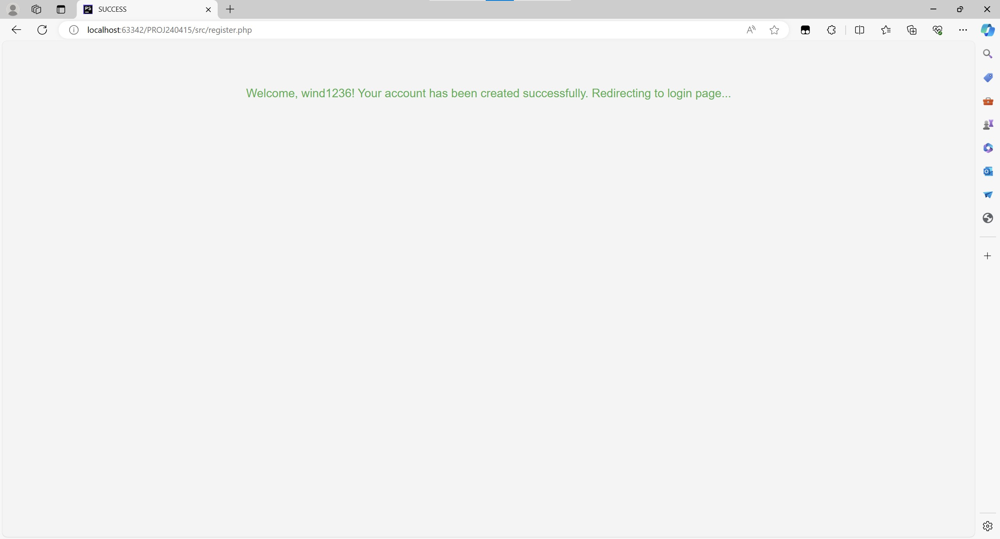

# 知识星球

本项目是基于PHP的一个论坛管理系统与平台。

系 Shanghai Normal University 2021级 PHP程序设计课程的期末大作业。

## 项目简介

本项目是一个基于PHP的知识类论坛管理系统，用户可以在本网站发布文章，浏览文章，参与文章的编辑（包括别人的！），并且可以使用TAG系统方便地查找自己感兴趣的文章。

### 网站基本功能简介

### 主要功能模块

#### 用户模块

本模块包含了管理用户的若干功能：

- 注册
- 登录
- 个人信息
    - 查看个人信息
    - 修改个人信息
- 修改密码（重置密码）
- 退出登录

#### 文章模块

本模块包含了管理文章的若干功能，按照功能可以分为：

- 浏览文章
- 创建文章
- 修改文章

##### 浏览文章

浏览功能主要分为按照更新时间排序的文章列表，按照TAG分类的文章列表，以及搜索功能。

1. 对于使用更新时间排序的文章列表

   用户可以选择合适的分页逻辑，查看文章的标题，作者，创建以及更新日期，TAG等。
2. 对于使用搜索功能获得的文章列表

   在上述功能的基础上，用户可以输入关键词，查找包含关键词的文章。
3. 对于使用TAG分类的文章列表

   在功能1的基础上，用户可以选择合适的TAG，查看包含该TAG的文章。

   此处的TAG选项由系统自动生成，是按照热度（包含该TAG的文章数量）倒序给出的。

   用户可以自由选择若干TAG，并可一键切换筛选TAG的逻辑：

    - 全包含
      筛选出包含所有选择的TAG的文章
    - 任意包含
      筛选出包含任意一个选择的TAG的文章

##### 创建文章

对于所有登录用户，均可以创建文章，创建文章时需要填写标题，内容，并在创建成功后自动成为文章的第一位作者。

##### 修改文章

对于所有管理员用户，均可以修改文章，修改文章主要包括：

- 对文章内容的修改
  可修改标题，内容。并在修改成功后自动成为文章的作者之一。
- 对文章TAG的修改
  可修改文章的TAG，包括增加或者删除TAG以及为该文章新建一个TAG，对TAG的修改不会影响文章的作者。
- 对文章的删除
  可删除文章，删除后文章将不再显示在文章列表中。

### 数据库设计

#### 数据库实体

1. Users（用户）:

    - **user_id: 主键，自增整数，唯一标识一个用户。**
    - username: 用户名，唯一且不包含逗号，用于用户登录。
    - password: 用户的密码，存储加密形式，保障账户安全。
    - email: 用户的电子邮件地址，用于联系和账户恢复。
    - is_admin: 布尔值，标记是否为管理员，用于控制权限。
    - created_at: 时间戳，记录用户账户的创建时间。

2. Articles（文章）:

    - **article_id: 主键，自增整数，唯一标识一篇文章。**
    - title: 文章标题。
    - content: 文章内容，以长文本形式存储。
    - created_at: 时间戳，文章的创建时间，自动创建。
    - updated_at: 时间戳，文章的最后更新时间，自动更新。

3. Tags（标签）:

    - **tag_id: 主键，自增整数，唯一标识一个标签。**
    - tag_name: 标签名称，唯一且不包含逗号。

4. Article_Tags（文章标签关系）:

    - **article_id 和 tag_id: 复合主键，标识文章和标签的关系。**
      外键关系指向 Articles 和 Tags 表，支持级联删除。

5. Article_Authors（文章作者关系）:

    - **article_id 和 user_id: 复合主键，标识文章和作者的关系。**
      外键关系指向 Articles 和 Users 表，支持级联删除。

#### 数据库关系

多对多关系:

- Articles 和 Tags: 通过 Article_Tags 表实现多对多关系，一篇文章可以有多个标签，一个标签可以标注多篇文章。
- Articles 和 Users: 通过 Article_Authors 表实现多对多关系，一篇文章可以有多个共同作者。

#### 数据库层API

视图:

- article_tags_view: 聚合视图，显示每篇文章及其所有标签。
- article_authors_view: 聚合视图，显示每篇文章及其所有作者。
- article_detail_view: 综合视图，显示文章详细信息，包括标题、作者、创建时间、更新时间、标签和内容。
- article_list_view: 文章列表视图，显示文章的基本信息，支持排序和分页。
- article_count_view: 文章计数视图，显示总的文章数量。
- tag_article_count_view：标签文章计数视图，显示每个标签下的文章数量。

存储过程:

- FetchArticlesByPage: 分页获取文章列表，支持按更新时间排序。
- FetchArticlesByTagsWithPaging: 根据标签（允许多个）过滤文章，并支持分页功能。允许部分标签匹配。
- FetchArticlesByAllTagsWithPaging: 根据标签（允许多个）过滤文章，并支持分页功能。要求完全匹配给定的标签。
- CreateArticle: 创建新文章，并将其与作者关联。
- UpdateArticle: 更新指定文章的内容和标题，并管理文章作者信息。当发生错误时主动返回错误信息。
- DeleteArticle: 根据文章ID删除文章。当发生错误时主动返回错误信息。
- UpdateArticleTags: 更新指定文章的标签，包括添加和删除标签（允许多个）。
- SearchArticlesWithPaging: 根据关键词搜索文章，并支持分页功能。

### 网站各功能截图

#### 首页

#### 按照TAG浏览

#### 搜索页

### 用户管理

#### 注册

#### 登录

#### 个人信息

##### 查看个人信息

##### 修改个人信息

#### 修改密码

#### 退出登录

### 论坛管理

#### 创建文章

#### 编辑文章

#### 删除文章

#### 为文章编辑TAG

### 功能与文件对照表

| Function        | Nom de fichier     |
|:----------------|:-------------------|
| 网站的主页，用于文章的浏览功能 | index.php          |
| 关键字搜索功能         | search_results.php |

- db

  | Function | Nom de fichier |
          |:---------|:---------------|
  | 数据库初始化   | make.sql       |

- logs

  | Function   | Nom de fichier   |
            |:-----------|:-----------------|
  | 文章相关操作日志   | article_logs.txt |
  | 用户相关操作日志   | user.txt         |
  | 每日流量分析     | v1.php           |
  | 每日新增/活跃    | v2.php           |
  | 最热时段/页面/操作 | v3.php           |
  | 每日文章统计     | v4.php           |
  | 用户惯用分析     | v5.php           |
  | 日志分析导航页面   | view.php         |

- css

| Function | Nom de fichier |
|:---------|:---------------|
| 网站样式表    | style.css      |
| 网站样式表    | style1.css     |

- public
    - archile

      | Function          | Nom de fichier         |
                              |:------------------|:-----------------------|
      | 展示单个文章详情          | article.php            |
      | 更新文章TAG（包括增加新TAG） | article_tag_choice.php |
      | 创建文章              | create_article.php     |
      | 更新文章              | update_article.php     |

    - user

      | Function | Nom de fichier     |
                              |:---------|:-------------------|
      | 更新用户资料   | edit_profile.php   |
      | 用户登录     | login.php          |
      | 展示用户资料   | profile.php        |
      | 用户注册     | register.php       |
      | 找回（重置）密码 | reset_password.php |

- src
    - api

      | Function                      | Nom de fichier         |
                              |:------------------------------|:-----------------------|
      | API 增加新的TAG                   | add_tag.php            |
      | API 返回文章详情                    | article.php            |
      | API 返回文章总数                    | article_count_view.php |
      | API 为文章增加或者移除TAG              | article_tag.php        |
      | API 按照选择的TAG，返回分页后的文章列表（任意包含） | articles.php           |
      | API 按照选择的TAG，返回分页后的文章列表（全包含）  | articles_all_tags.php  |
      | API 新建文章                      | creat_article.php      |
      | API 删除文章                      | delete_article.php     |
      | API 返回文章包含的所有TAG              | get_article.php        |
      | API 返回标题中包含关键字的所有文章的分页列表      | search_articles.php    |
      | API 返回所有TAG（按照热度降序）           | tags.php               |
      | API 更新文章                      | update_article.php     |

  | Function     | Nom de fichier     | 
          |:-------------|:-------------------|
  | 生成验证码        | captcha.php        |
  | 用于数据库连接的基本配置 | config.php         |
  | API 校验用户登录   | login.php          |
  | API 用户登出     | logout.php         |
  | API 校验用户注册   | register.php       |
  | API 重置用户密码   | reset_password.php |
  | API 更新用户个人资料 | update_profile.php |

## 功能实现

### 基本浏览

#### 首页

#### 按照TAG浏览

#### 搜索页

### 用户管理

#### 注册

#### 登录

#### 个人信息

#### 修改密码

#### 退出登录

### 论坛管理

#### 创建文章

#### 编辑文章

#### 删除文章

#### 为文章编辑TAG

### 会话管理

#### $_SESSION

#### $_COOKIE

### 分页功能

### 日志功能

#### 日志记录

#### 日志分析

### 安全性设计

#### 密码加密

#### 登录验证码

#### SQL注入防范
